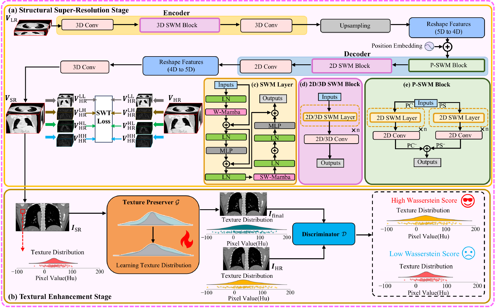

# WGMN: Wavelet-Guided Mamba Network for Texture-Faithful CT Super-Resolution
Tong Lin#, Yikun Zhang*, Yang Chen, et al.


## Abstract
> High-resolution computed tomography (HRCT) is essential for precise disease diagnosis but remains inaccessible in many clinical settings due to hardware limitations and dose constraints. Previous work has demonstrated the promising performance of deep learning (DL) methods in volumetric super-resolution (SR). However, it is still challenging for existing methods to adequately restore fine structures and preserve image texture, especially in coronal and sagittal views. In this context, this study proposes a data-driven two-stage framework to progressively achieve subtle-structure-enhanced and texture-preserving CT super-resolution. In the structural super-resolution stage, a Wavelet-Guided Mamba Network (WGMN) is developed to perform volumetric super-resolution. On the one hand, Mamba attention is integrated into WGMN to overcome the limitations of convolutional neural networks (CNNs) in capturing long-range dependencies, enabling efficient modeling of volumetric contextual information while maintaining high inference efficiency. On the other hand, WGMN is supervised by a wavelet-guided joint loss to ensure frequency consistency across multiple orientations between SRCT and HRCT, thereby enhancing subtle structure recovery. In the textural enhancement stage, the adversarial learning mechanism is adopted to improve the consistency of texture distribution between HRCT and SRCT in the coronal view, thereby achieving texture-preserving super-resolution. Quantitative and qualitative evaluations on three publicly available datasets demonstrate the promising performance of the proposed method in fine structure restoration and texture preservation while maintaining inference efficiency.

## Architecture Diagram
<p align="center">  </p>

## Visual Comparisons
<p align="center">  </p>


## Usage
### 1.Environment Setup
```
cd code
```
### 2. Model Training
To begin Stage I training:
```
python train_stage1.py --path_key HD --gpu_idx 0 --model mambav2 --net_idx HD_Mamba
```

To begin Stage II training:

```
python train_stage2.py
```

### 3. Model test

To begin Stage I testing:
```
python test_stage1.py --path_key HD --gpu_idx 0 --model mambav2 --net_idx HD_Mamba
```

To begin Stage II testing:
```
python test_stage2.py
```

## Pretrained Weights
Pretrained MBSRN and Texture-Preserver can be downloaded here: [baidu cloud disk](https://pan.baidu.com/s/1cKZYfcVtFJ1dp8--i-fv_A?pwd=p9st).  


## Dataset Structure

The dataset directory of Stage I should be organized as follows:
```
data/
|-- HD_1mm/
|  |-- CT00000000.nii.gz
|  |-- CT00000001.nii.gz
|  |-- CT00000002.nii.gz
|-- HD_5mm/
|  |-- CT00000000.nii.gz
|  |-- CT00000001.nii.gz
|  |-- CT00000002.nii.gz
```
HD_1mm/: High-resolution thin-slice CT data

HD_5mm/: Corresponding thick-slice CT data for training input

The dataset directory of Stage II should be organized as follows:

```
data/
|-- train/
|  |-- full/
|       |-- full-0001.npy
|       |-- full-0002.npy
|       |-- full-0003.npy
|  |-- sparse/
|       |-- sparse-0001.npy
|       |-- sparse-0002.npy
|       |-- sparse-0003.npy
|-- test/
|  |-- full/
|       |-- full-0001.npy
|       |-- full-0002.npy
|       |-- full-0003.npy
|  |-- sparse/
|       |-- sparse-0001.npy
|       |-- sparse-0002.npy
|       |-- sparse-0003.npy
```
## Notes
Code and model configurations are tested under Python 3.9+, PyTorch 2.2+ and Mamba-ssm 2.2.4 environments


## Acknowledgment

This repository is an implementation and extended adaptation of WGMN:Wavelet-Guided Mamba Network for
 Texture-Faithful CT Super-Resolution, with additional refinements in code structure, documentation, and model reproducibility.


